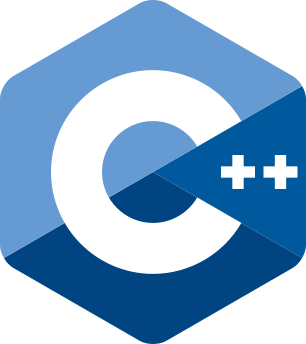
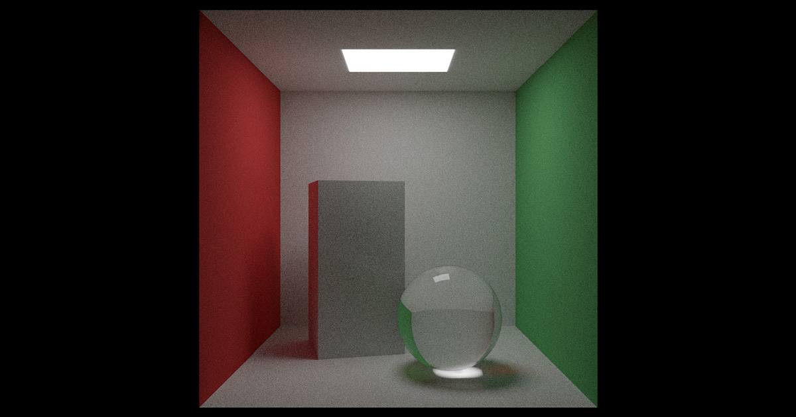
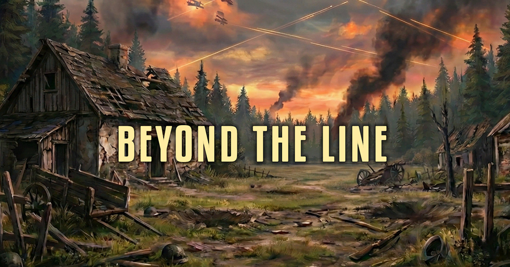
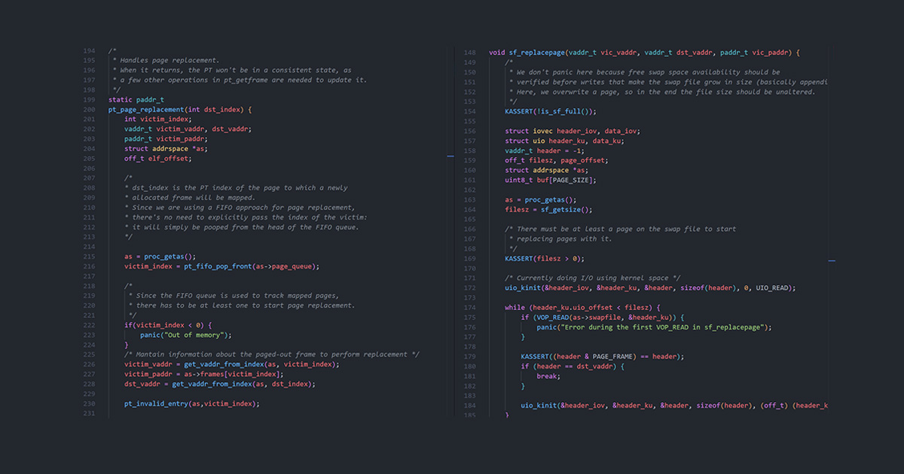
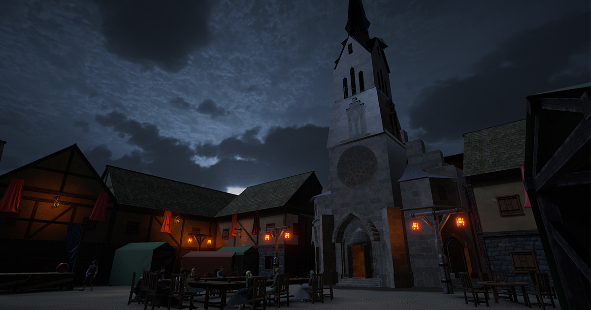

- Computer Engineer and Game Programmer
- From high-level systems to low-level optimization
- [Portfolio](https://giulio-arecco.github.io) · [LinkedIn](https://linkedin.com/in/giulio-arecco) · [Email](mailto:giulioarecco@gmail.com)

## Featured Repositories

<table>
  <tr>
    <td width="34%" valign="middle">
      
    </td>
    <td width="66%" valign="middle">
      <h3><a href="https://giulio-arecco.github.io/projects/path-tracer/">Zig Path Tracer</a></h3>
      
<strong>Zig · Computer Graphics</strong>

      
A CPU-based Monte Carlo path tracer written in Zig.

      <a href="https://github.com/giulio-arecco/zig-path-tracer"><strong>View Repository →</strong></a>
    </td>
  </tr>
  <tr>
    <td width="34%" valign="middle">
      
    </td>
    <td width="66%" valign="middle">
      <h3><a href="https://giulio-arecco.github.io/projects/beyond-the-line/">Beyond The Line</a></h3>
      
<strong>C# · Unity · Game Development</strong>

      
A text-based serious game developed as a Master's thesis to explore Complex Problem Solving.

      <a href="https://github.com/giulio-arecco/beyond-the-line"><strong>View Repository →</strong></a>
    </td>
  </tr>
  <tr>
    <td width="34%" valign="middle">
      
    </td>
    <td width="66%" valign="middle">
      <h3><a href="https://giulio-arecco.github.io/projects/demand-paging-os161/">OS/161 Demand Paging</a></h3>
      
<strong>C · Systems Programming</strong>

      
OS161 kernel extension implementing on-demand paging, swap space management.

      <a href="https://github.com/LienoPC/OS161-DemandPaging"><strong>View Repository →</strong></a>
    </td>
  </tr>
  <tr>
    <td width="34%" valign="middle">
      
    </td>
    <td width="66%" valign="middle">
      <h3><a href="https://giulio-arecco.github.io/projects/the-plague-in-milan/">The Plague in Milan</a></h3>
      
<strong>C# · Unity · Game Development</strong>

      
An interactive first-person experience set in 17th-century Milan as depicted in Alessandro Manzoni's "The Betrothed".

      <a href="https://github.com/giulio-arecco/the-plague-in-milan"><strong>View Repository →</strong></a>
    </td>
  </tr>
</table>

<strong> [See More](https://giulio-arecco.github.io/projects/) </strong>
